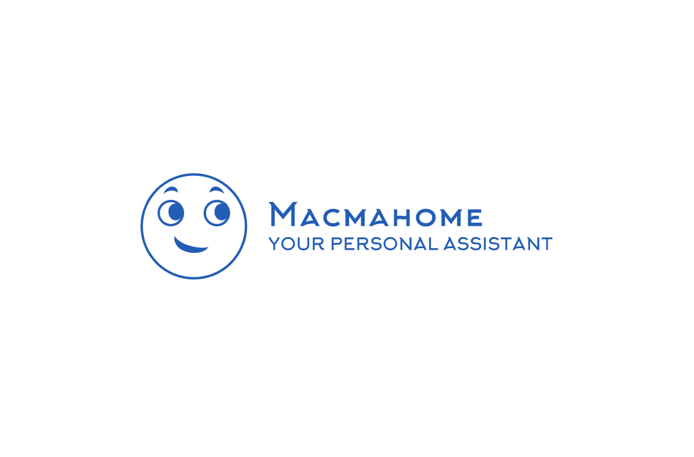

# macmahome-backend

Macmahome is your personnal assistant, helping you to organise your life.

This repository is the backend for Macmahome application.

## Project specification

- version: 0.1
- author: Kévin L <kevin.letupe@gmail.com>
- language: Go (version 1.7)

Main packages used for runtime: [gorm](https://gorm.io/), [gin-gonic](https://gin-gonic.com/)

Main packages used for test/development: [testify](https://github.com/stretchr/testify), [swag](https://github.com/swaggo/swag/blob/master/README.md)

## Setup local development environment.

To develop on this repository, we advice you to have VsCode and Docker install locally. Thanks to the ms-vscode-remote.remote-containers extension and the content of .devcontainer directory, you can create a docker development stack with the following container:
- api: your backend application
- db: development postgres database
- swagger: service to serve the swagger documentation of the API

Your working container will be "api". The container is configured to correctly run your api. Just open a terminal and type `go run main.go` to start the API.

Note that the data created by the database are persit in the directory `$WORKDIR/data`

## Consult/Create API documentation

The package [swag](https://github.com/swaggo/swag/blob/master/README.md) is used to generate swagger documentation. Just type `swag init` to generate documentation. Generated files are stored in `./docs`

The container service call "swagger" serve the generated documentation. You can consult it on localhost:4040

## Run Unit Tests

The package [testify](https://github.com/stretchr/testify) is used to implement unit tests.

To run tests, just type the command:

`go test github.com/kevinl75/macmahome-backend/test`
